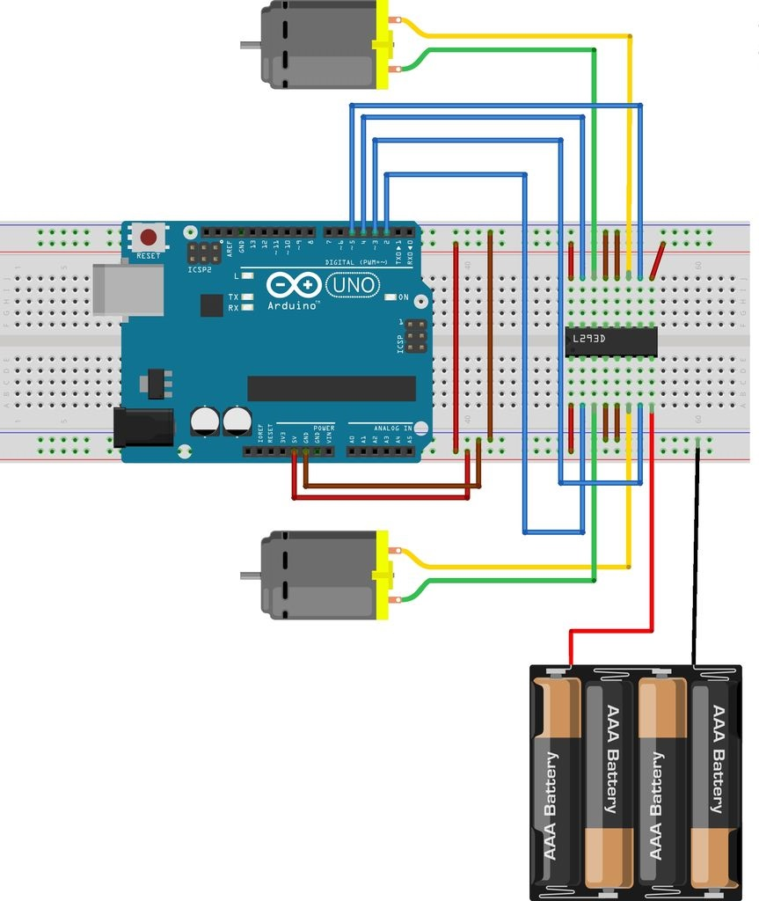
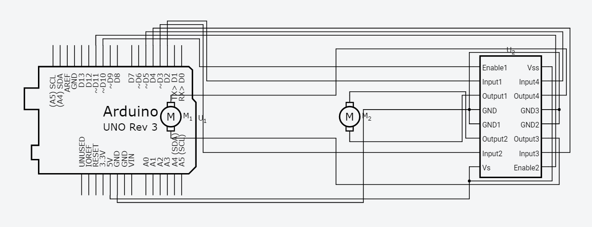

# arduino-dc-motor
## Control a DC Motor with an Arduino

### Hardware required
- 1 x L298n module (or L293d H-bridge Motor Driver)
- 1 x DC motor
- 1 x Arduino uno r3
- jumper wires (a bunch of them)
- Power source (eveready battery LOL)

### Circuit (with L293d)

### Schematics (with L293d)

### Picture of a working model (with L298n)

### Sources

https://www.allaboutcircuits.com/projects/control-a-motor-with-an-arduino/  
http://www.instructables.com/id/Control-DC-and-stepper-motors-with-L298N-Dual-Moto/  
https://www.hackerstore.nl/PDFs/Tutorial298.pdf  
http://forefront.io/a/beginners-guide-to-arduino/  
http://aiaaocrocketry.org/AIAAOCRocketryDocs/SPARC2014/Arduino%20Uno%20Overview.pdf  
https://www.arduino.cc/en/tutorial/memory  
